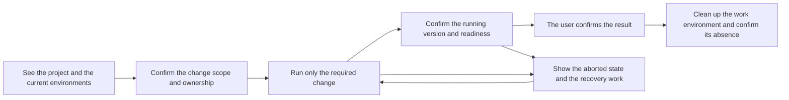

# Grove's value, its competitive position, and the experience it intends to give

Written 2026-09-05. Status: product direction analysis and a verification
proposal. Implementation base: `d7fa8c9988887b605512f3bb5d2f1fa9b6a48f54`.
This document is not an operating specification and not an approval to
implement. Current behaviour is owned by
[the skill](../skills/grove/SKILL.md),
[the profile](../skills/grove/references/runtime-profile.md), and
[the overlay contract](../skills/grove/references/overlay-contract.md).

## The judgment

**What Grove publishes is a shared contract, and a reproducible verification
tool, for several workers to run a change in a shared development environment,
confirm that it really took effect, and recover from a failure.**

A visitor to the public repository should be able to run the examples, connect
their own backend, and verify the same failure conditions without knowing any
particular organization's environment or adoption history.
[The independent Kubernetes experiment](evaluation/kubernetes/README.md) gives
that experience. The grounds for investing heavily in a standalone product, and
the real productivity effect, have to be verified separately.

What has been secured so far is an execution contract that reduces false
completion judgments, plus regression verification. A user's time saved, a
reduction in operator intervention, reuse across real projects, cost saving, and
outside adoption intent are still `notMeasured`. Implementation correctness and
product value are different questions.

The value Grove should focus on is this: the rules for using the environment do
not have to be explained again when the worker changes; the requested change can
be confirmed as actually ready; and aborted operations and leftover environments
are tracked. The investment criterion is how much it reduces the work a person
used to judge by hand, from an environment's preparation through to its
shutdown.

## Whose problem, and which problem

| Who, and in what situation | The repeated cost | What Grove aims to reduce | Fit judgment |
| --- | --- | --- | --- |
| A developer moving between several projects on the same machine | Working out the addresses, engines, how a change is applied, and the data boundary again | Discovering each project's values in the same shape | The more often the operating style differs, the better the fit |
| Several agents confirming changes at the same time on a shared baseline | Overwriting each other's deploys, confirming the wrong version, leftover environments | A shared contract for the change's scope, its lifetime, and the completion judgment | The core target. Requires the project's own overlay and routing implementation |
| The person who looks after a shared environment | Repeated intervention on whether a run is allowed, and on failure and cleanup requests | Stating the approved scope, and preserving the failure state and the recovery path | Value only appears if intervention time actually drops |
| Someone developing one small app alone | A relatively simple start and stop | Writing a profile and maintaining an adapter may be added burden | Do not adopt it if the existing tools are enough |

The number of services matters less as a screening criterion than concurrent
work, environment switching, and dependence on other people's state. Even a
project with many services has weak reason to adopt a complex overlay scheme if
its conflict and coordination costs are small.

## The experience it intends to give

The experience a user should feel is this sentence.

> I know which change and which address I am checking, I finish the check
> without disturbing anyone else's work, I can carry on after being cut off
> partway, and after finishing I do not have to guess again about what
> environment is left behind.

This is the target experience. It does not mean the current CLI provides all of
it automatically.

| Moment in the work | The answer the user needs | What is provided now, and the gaps |
| --- | --- | --- |
| Entering the project | Where do I look, and what do I run | Profile and URL output are provided. DNS, listeners, and an integrated status screen are not |
| Starting work | What is the scope I may change, and who owns it now | The ownership procedure is documented. Automatic discovery and acquisition of the baseline writer is the project's job |
| Confirming a change | Only my change is applied, and which baseline does the rest use | Overlay dispatch and the lease are provided. Build, workload, and fallthrough are the adapter's and the project's job |
| Confirming completion | Is the run image I asked for ready | The adapter's runtime image and readiness state are compared. The real request path and data consistency are verified separately |
| A failure partway | What was applied, and what do I have to retry | A pending record, retrying the same operation, and confirming after observation |
| Finishing work | Is the environment I created gone | The registry is cleaned up after confirming the absence the project reports. There is no automatic expiry controller |

Setting a project up the first time needs explanation and judgment. But it is a
failed experience if the same questions have to be answered again from the next
piece of work on the same project. Do not aim at a flow where an already granted
permission is requested repeatedly, or where the user has to read the registry
and the JSON directly to know the next action. The internal contract helps the
agent; a person has to see the target, the progress, the reason it is blocked,
and the decision needed.

## What is left once you compare it with the alternatives

Below is a feature comparison of the official documentation, checked on
2026-09-05. It is not a survey of price, adoption rate, performance advantage,
or every feature of each product. The last column is a judgment based on that
material and on Grove's current implementation. It is also not a claim that the
same contract could not be implemented on another tool.

| Alternative | The experience found in the official documentation | What it implies for Grove |
| --- | --- | --- |
| Docker Compose Watch | Sync, rebuild, and restart on file changes. [Official documentation](https://docs.docker.com/compose/how-tos/file-watch/) | Code-apply speed and a unified start command are not enough to differentiate. Where it already works well, use it |
| OrbStack | Automatic domains for containers and Compose services, web port detection, and HTTPS. [Official documentation](https://docs.orbstack.dev/docker/domains) | Reaching things by name already exists. Grove, which prints URLs, cannot claim an advantage on address convenience alone |
| Tilt | Syncs files into a running container, runs commands, and rebuilds when needed. [Official documentation](https://docs.tilt.dev/live_update_reference.html) | It is sounder to attach a shared operating contract to the existing development loop than to build fast iterative development anew |
| DevSpace | A Kubernetes development environment, file sync, port forwarding, and project pipelines. [Official documentation](https://www.devspace.sh/docs/getting-started/development) | Growing to the scope of rebuilding a whole Kubernetes development environment increases both the adoption burden and the competitive surface |
| Telepresence | Forwards a service's traffic to a local process and intercepts only the requests matching a condition. [Official documentation](https://telepresence.io/docs/concepts/attachments) | The very concept of verifying some changes alongside a shared environment is not exclusive either. There is no ground for claiming originality in the routing technique |
| A team's existing project scripts and operating documents | The alternative each team already has. The concrete cost and quality have to be measured per project | This is the most important thing to compare against. If Grove does the same job with more configuration, it is better not to adopt it |

## Where a competitive position could come from

### 1. The link between rules a person reads and a contract an agent runs

The skill explains when it is allowed to run and what counts as complete. The
profile supplies the project's values, and the CLI checks state transitions and
receipts. The differentiation hypothesis is that the same judgment can be
applied repeatedly even when the model and the project change.

Today that link is partial. The CLI checks the overlay transitions, but baseline
writer ownership and the ban on shared DB access are largely procedure. Grove is
not a security isolation device that stops an agent from running an arbitrary
shell, and it assumes a trusted project adapter.

### 2. A work lifetime that includes aborts and failures

The strength of the current implementation is a contract that covers more than a
successful start: it leaves an unconfirmed operation behind, confirms it after
observation, and tracks a failed cleanup too. When several short agent tasks use
the same environment, this can reduce the operator's checking cost. The saving
itself has not been measured yet.

### 3. Integration cost that shrinks from the second project on

Defining shared commands does not by itself complete reuse. If status queries,
image mapping, routing, and recovery have to be written again for every new
project, the cost of generalizing is high. An adapter verified on a real project
and a shared conformance check have to be reusable. The fixtures and the process
execution checks provided today are not a record of product adapters in the
field.

### 4. Verification assets that reproduce failure cases

Checks that reproduce a wrong image, an unready service, an aborted dispatch,
and a failed cleanup under the same contract help with maintenance. But the
number of tests, or a small CLI in itself, is not an asset that is hard to copy.
A competitive position appears only once compatibility gathered from several
projects, maintained adapters, procedures that diagnose a problem quickly, and
real operational trust have accumulated.

There is no ground to say a market moat or a network effect has been secured
today. Open source value has to show first in a clear contract, runnable
examples, verification grounds that include failures, and extension points where
a backend can be connected. The saving in real repeated cost is measured
separately.

## Where the current value weakens

- **Printing a name does not complete a clickable environment.** If DNS and
  routing setup is hard, the burden up to the first success stays with the user.
- **Sharing is a different choice from isolation.** Shared engine failures,
  schema compatibility, fixture collisions, and effects on consumers and brokers
  remain. A service overlay must not be described as data isolation.
- **A single writer can become a bottleneck.** The time gained from fewer
  conflicts and the time lost waiting for ownership have to be measured
  together. Adding procedure alone does not guarantee a net gain.
- **The adapter has to report the facts accurately.** Echoing back the requested
  image string makes a weak system that looks like strong verification. Real
  backend observation is required.
- **There is a boundary between fast code reload and immutable image
  confirmation.** In a development style that changes source in a running
  process, matching images alone cannot prove the current source content. A
  project contract that separates repeated editing from final verification is
  needed, and there is no general-purpose source identity check today.
- **Contract changes carry a cost.** If status responses and profile validation
  are strengthened, consuming adapters have to follow. Without a compatibility
  explanation and regression verification, standardizing becomes a new source of
  failure.

## How to check whether it is worth enough

The current judgment rests on the code, the documents, and
[the execution evidence](evidence/2026-09-05-catalog-review.md). Productivity
experiments on shared infrastructure or on a consuming project were not part of
this analysis work. [The synthetic app development experiment](evaluation/2026-09-05-synthetic-evaluation.md)
checks the cost of run management and the failure recovery behaviour. Keep it
separate from evidence of a real team's productivity improvement.
[The real Git worktree experiment](evaluation/2026-09-05-worktree-evaluation.md)
checked concurrent edit, build, deploy, and cleanup on separate branches. The
project-wide serialization problem found there was fixed by
[the per-overlay parallel execution change](evidence/2026-09-05-overlay-parallel.md)
and verified again without the retries at the experiment's call site.
[The Kubernetes execution record](evidence/2026-09-06-kubernetes-lifecycle.md)
checks a real image build, overlay routing, and abort and recovery against the
synthetic web and API included in the repository.

The following is a small proposed evaluation. It is not a schedule and not an
approved target number. The evaluation scope and the run order live in
[the shared evaluation procedure](evaluation/grove-pilot.md). A consuming
project's identifying information and measurement results are not left in the
documentation.

1. Choose two real consuming projects with different operating styles. At least
   one has to be a situation where two or more workers must confirm changes at
   the same time.
2. Perform similar work under the existing procedure and under the Grove
   procedure. Record the state of the environment, the cache, and image
   preparation, and measure the first installation cost and the repeated work
   cost separately.
3. Check not only a normal change but also a leftover previous image, a
   readiness failure, an aborted operation, and a failed cleanup, within an
   isolated allowed scope. Injecting failures into a shared environment needs
   separate approval.
4. Fix the pass criterion and the sample size with the operator before the
   evaluation. Do not pick the good cases out of a small sample and conclude
   that overall productivity improved.

| Metric | Measurement window or judgment | Current |
| --- | --- | --- |
| First adoption cost | Working time from starting to write the profile to confirming the first real change | notMeasured |
| Setup time for repeated work | From requesting a change check to a usable environment on the correct version | notMeasured |
| Operator intervention | The number of extra explanation and judgment requests per task and the time they take. Includes re-confirming an already approved scope | notMeasured |
| False completion | The number of times something was marked successful while the requested version or readiness condition did not match | consuming project notMeasured |
| Cleanup cost and leftover environments | The number of trackable leftover workloads after finishing, and the manual recovery time | consuming project notMeasured |
| Shared side effects | Cases that affected another piece of work's deploy, data, or availability | notMeasured |
| Reusability | Integration and maintenance time for the first and the second adapter | notMeasured |
| Resource cost | Real process and container resource use and duration under the same workload conditions | notMeasured |

Compare the economics within the same evaluation period. Look at whether the
time saved on repeated work, minus the extra maintenance and the time waiting
for ownership, is positive, and judge over what period the initial integration
cost has to be recovered. Do not compute a memory saving from a design that
claims to reduce duplicate environments.

**Condition to expand:** when the second project also reuses most of the shared
contract, the net cost of repeated work falls, and false completions and shared
side effects are held to an acceptable level.

**Condition to scale down:** when a separate platform has to be written for each
project, or when the cost of maintaining the profile, waiting for approval, and
recovering from failures exceeds the time saved even in repeated work. In that
case, keep only the useful documents and verification tools and stop extending a
general-purpose runtime.

## The order of the next investment

1. Confirm the target experience from start to finish on one real consuming
   adapter.
2. Confirm the reuse cost on a second project with a different operating style.
3. Extract only the differences that repeat, and improve the adapter conformance
   check and the error guidance.
4. Based on that result, reduce the single largest friction among installation,
   status discovery, and address connection.

Increasing the proxy, the dashboard, remote machines, or the number of skills
first is no substitute for this verification. Use what the existing tools
already solve, and focus on the coordination cost the shared contract actually
reduces. Add a new catalog skill only after a pattern has been confirmed useful
more than once.

An appropriate proposal for the current introduction line is this.

> Grove helps several projects and agents handle running, confirming,
> recovering, and cleaning up a change under the same rules when they use a
> shared development environment.

The result that proves this line's value is not the number of skills or the
number of tests. It is a fall in the time a user spends explaining the
environment again and recovering it.
